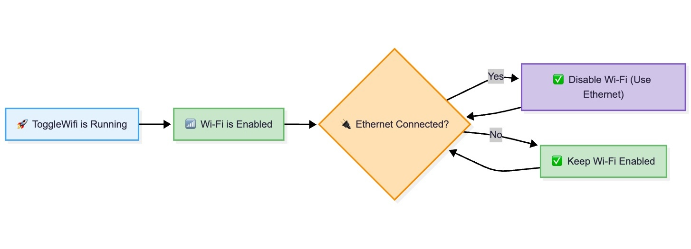

# ToggleWiFi

<div align="center">
  
  
  
  
  
</div>

<p align="center">
  <strong>🔌 Intelligent Wi-Fi Management for macOS</strong>
</p>

<p align="center">
  A lightweight menu bar application that automatically toggles Wi-Fi based on Ethernet connection status, helping you maintain optimal network performance and battery life.
</p>

## ✨ Features

- **🔄 Automatic Wi-Fi Toggle**: Intelligently disables Wi-Fi when Ethernet is connected
- **📱 Menu Bar Integration**: Clean, native macOS menu bar interface
- **🌐 Multi-Language Support**: Available in English and German
- **🔔 Native Notifications**: System notifications for connection changes
- **⚙️ Customizable Settings**: Configure auto-toggle behavior and launch preferences
- **🚀 Launch at Login**: Optional automatic startup
- **🎯 Manual Override**: Click to manually toggle Wi-Fi when needed
- **📊 Real-time Status**: Live connection status monitoring

## Screenshots

### Application Workflow



### Settings Screen

#### English


#### German


### Menubar


### Notifications upon status change


---

## 🖥️ System Requirements

- macOS 14.0 or later
- Xcode 15.0 or later (for building from source)
- Administrator privileges (for network interface control)

## 🚀 Installation

### Option 1: Build from Source

1. **Clone the repository**

```bash
  git clone https://github.com/fahidnasir/ToggleWiFi.git
  cd ToggleWiFi
```

2. **Open in Xcode**

```bash
  open ToggleWiFi.xcodeproj
```

3. Build and Run

- Select your development team in project settings
- Build and run the project (⌘+R)

### Option 2: Download Release

Visit the Releases page
Download the latest .dmg file
Install the application

    ⚠️ Note: macOS may show a security warning when opening this app for the first time.

    Option 1: Right-click on the App Icon in /Applications → Open → Allow Anyway.

    Option 2: Open "Privacy & Security" in Mac settings window and scroll down to the bottom and last security failed app will appear there and you can Allow Anyway.

### 🎯 Usage

Launch the app - ToggleWiFi will appear in your menu bar
Left-click the icon to manually toggle Wi-Fi
Right-click the icon to access settings and options
Configure settings to enable/disable automatic behavior
Choose your language from the settings panel

### Menu Options

Enable Auto Wi-Fi: Toggle automatic Wi-Fi management
Settings: Configure app preferences and view status
About: View app information
Quit: Exit the application

### ⚙️ Settings

Auto Wi-Fi Toggle: Enable/disable automatic Wi-Fi management
Launch at Login: Start ToggleWiFi automatically when you log in
Language Selection: Choose between English and German
Connection Status: Real-time Ethernet and Wi-Fi status display

### 🌐 Localization

ToggleWiFi supports multiple languages:

- 🇺🇸 English (Default)
- 🇩🇪 German (Deutsch)

### Adding New Languages

1. Create a new .lproj folder for your language
2. Add translated Localizable.strings file
3. Update the language list in SettingsView.swift

### 🔧 Technical Details

#### Architecture

- SwiftUI: Modern declarative UI framework
- Network Framework: Real-time network monitoring
- UserNotifications: Native macOS notifications
- ServiceManagement: Launch at login functionality

#### Key Components

- `MenuBarManager`: Handles menu bar interactions and notifications
- `NetworkMonitor`: Monitors Ethernet connection status
- `WiFiManager`: Controls Wi-Fi interface via networksetup
- `LocalizationManager`: Manages app localization
- `SettingsView`: Configuration interface

#### Permissions

The app requires:

- Network client entitlement for monitoring connections
- Apple Events automation for system interaction
- App sandbox disabled for network interface control

### 🤝 Contributing

Contributions are welcome! Please feel free to submit a Pull Request.

#### Development Setup

1. Fork the repository
1. Create a feature branch (git checkout -b feature/AmazingFeature)
1. Commit your changes (git commit -m 'Add some AmazingFeature')
1. Push to the branch (git push origin feature/AmazingFeature)
1. Open a Pull Request

#### Code Guidelines

- Follow Swift style guidelines
- Maintain localization for all user-facing strings
- Test on multiple macOS versions
- Document new features

### 🐛 Bug Reports

If you encounter any issues, please create an issue on GitHub with:

- macOS version
- Steps to reproduce
- Expected vs actual behavior
- Console logs (if applicable)

### 📄 License

This project is licensed under the MIT License - see the LICENSE file for details.

### 🙏 Acknowledgments

- Apple's Network Framework documentation
- SwiftUI community resources
- macOS development community

### 📞 Support

- 📧 Create an issue on GitHub
- 💬 Start a discussion in the repository
- ⭐ Star the project if you find it useful!

<div align="center">
  <p>Made with ❤️ for the macOS community</p>
  <p>
    <a href="https://github.com/fahidnasir/ToggleWiFi/issues"
      >Report Bug</a
    >
    ·
    <a href="https://github.com/fahidnasir/ToggleWiFi/issues"
      >Request Feature</a
    >
  </p>
</div>
